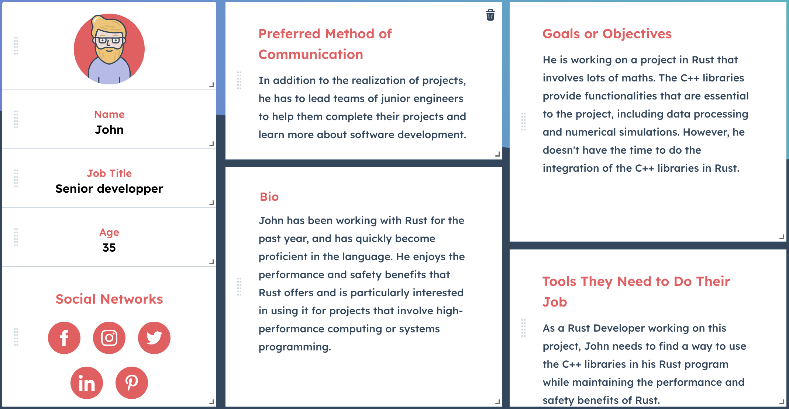
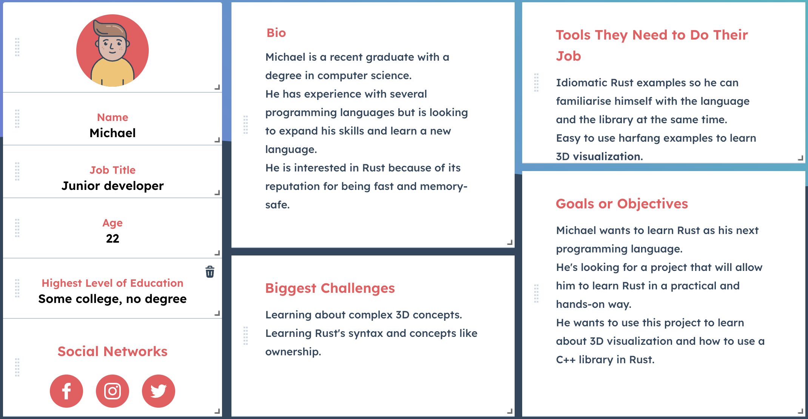
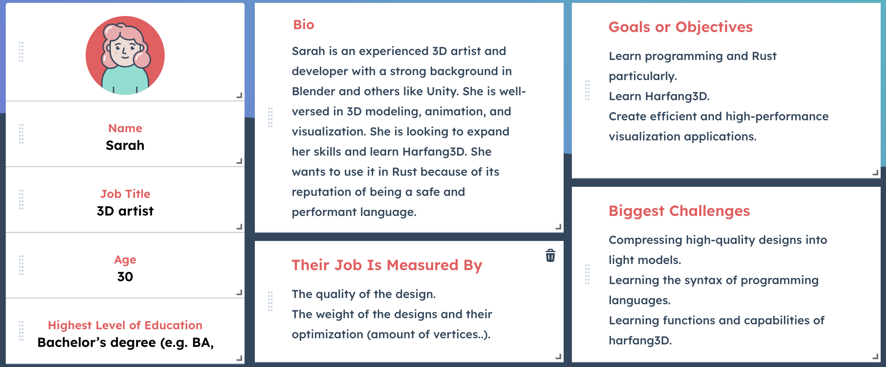

# **Functional Specifications**

<details>
<summary>
Table of contents
</summary>

* [Introduction](#Introduction)
* [Use case](#Use-case)
* [Personas](#Personas)
* [Objectives](#Objectives)
* [Scope](#Scope)
* [Requirements](#Requirements)
* [Deliverables](#Deliverables)
* [License](#License)
* [Compatibility](#Compatibility)
* [Competitors](#Competitors)
* [Documentation](#Documentation)
* [Testing](#Testing)
* [Support](#Support)
* [Conclusion](#Conclusion)
* [Glossary](#Glossary)
</details>

## Project Team

| Members         | Roles             |
| --------------- | ----------------- |
| [Ivan Molnar](https://github.com/ivan-molnar)        | Project Manager   |
| [Mathis Kakal](https://github.com/mathiskakal)       | Tech Lead         |
| [Maxime Pages](https://github.com/MaximePagesAlgoSup)| Software Engineer |
| [Matieu Chaput](https://github.com/Chaput-Mathieu)   | Program Manager   |

## Introduction
The main objective of this project is to allow Rust programs to utilize the functionality of the all-in-one 3D visualization library, [Harfang3D](https://github.com/harfang3d/harfang3d), by creating a binding between C++ and Rust using [Fabgen](https://github.com/ejulien/FABGen). This will enable Rust developers to use Harfang3D's C++ engine in their programs.Fabgen is a tool for generating bindings for C++ libraries. Fabgen was created for the Harfang3D project to enable usage of the C++ engine in other languages such as Python, Lua, and Go. This document outlines the requirements for the addition of a Rust binding to Fabgen, which will allow Rust programs to use the functionality provided by C++ libraries.

## Use case
* User wants to use a C++ library in Rust
    * User describes the functions they want in a python file
    * User uses Fabgen to generate a Rust binding for the C++ library
    <!--* User download library/.o  -->
    * User imports the library/crate created by Fabgen
    * User uses the Rust binding in their Rust program

## Personas





## Objectives
The main objectives of the binding are to:
* Provide Rust programs with access to all of C++'s functions and data structures.
* Be easy to use and integrate into Rust programs, with a clear and simple API that is easy to learn and use.
* Be well-tested, following Fabgen's existing templates, to ensure that it works correctly and is reliable.
* Be released under an open-source license, allowing developers to use and modify it as needed.
* Be as well optimized as possible not to slow down programs using the library
* Make the Rust code as user-friendly as possible by using idiomatic language.

## Scope
The scope of the binding includes:
* All <!-- Fabgen?--> functions and data structures in C++.
* Tests for the binding, including unit and integration tests, following Fabgen's existing templates, to ensure that it works correctly and is reliable.
* Support for all platforms supported by Fabgen, including Windows, and Linux.
* Documentation for all functions and data structures, including descriptions of their behavior and usage examples.

<!-- ## Out of scope -->

## Requirements
The binding must meet the following requirements:
<!-- * Be implemented as a Rust crate -->
* Provide Rust programs with access to all of C++'s functions and data structures.
* Be easy to use and integrate into Rust programs, with a clear and simple API that is easy to learn and use.
* Be well-tested, with comprehensive unit and integration tests, following Fabgen's existing template, to ensure that it works correctly and is reliable.
* Support all platforms that Fabgen supports, including Windows and Linux.
* Be released under an open-source license, allowing developers to use and modify it as needed.
* Provide documentation for all functions and data structures, including descriptions of their behavior and usage examples.
<!-- * Be as well optimized as possible not to slow down programs using the library -->

## Risks and Assumptions
The following risks and assumptions have been made:
* Fabgen is a viable solution for generating bindings for C++ libraries.
* Fabgen will be able to generate a binding for the C++ library that is compatible with Rust.
* Fabgen will be able to generate the documentation for the binding.
* The template for the tests is complete and reliable.

## Deliverables
The final deliverables for the binding will include: 
<!-- * The Rust crate, including all necessary Rust code and configuration files. -->
* The extension of Fabgen capable of building the Rust library 
* Documentation for the binding, including descriptions of all functions and data structures, usage examples, and any other necessary information.
* Tests for the binding, including unit and integration tests, following Fabgen's existing templates, to ensure that it works correctly and is reliable.

## Competitors
* [rust-bindgen](https://rust-lang.github.io/rust-bindgen/): It is a Rust library that generates Rust FFI bindings to C and C++ libraries.

* [FFI (Foreign Function Interface)](https://doc.rust-lang.org/nomicon/ffi.html): Allows Rust programs to call C functions. It is a low-level library that requires the developer to write lots of unsafe code. It is not compatible with C++ libraries.

* [rustcxx](https://github.com/google/rustcxx): It is a Rust library that allows Rust programs to call C++ functions. It is a high-level library that requires the developer to write lots of unsafe code. It is not compatible with C libraries. It also hasn't been updated since 2016.

* [SWIG](https://www.swig.org/): It is a well-known binding generator supporting lots of target languages. It is old and complex and lacks some features when binding some languages.

## Compatibility
The binding should be compatible with the latest stable version of Rust as well as any earlier versions that are still in active use. It should also be compatible with all platforms that Fabgen supports, including Windows and Linux.

## Documentation
The documentation for the binding will be generated automatically by Fabgen. 

## License
The binding will be released under an open-source license, allowing developers to use and modify it as needed.

## Testing
The binding will be tested following the templates existing in the Fabgen project. The tests will include unit and integration tests to ensure that it works correctly and is reliable.
<!-- 
## Deployment
The binding should be distributed as a fork of the existing repository of the Harfang3D C++ API. The fork should include all necessary Rust code and configuration files and should be kept up to date with the latest version of the C++ API. -->

## Support
Users will be able to file bug reports and feature requests on the project's issue tracker on Github. 

## Examples
### FABGen
In order to use the Rust binding, the user must first describe the functions they want in a python file. Here is an example on how to do it:
C++ files you want to import:

subtracter.h:
```c++
#pragma once
int subtracter(int a, int b);
float subtracter(float a, float b);
```
adder.h:
```c++
#pragma once
int adder(int a, int b);
float adder(float a, float b);
```
Python file describing the functions you want to use:
```python
import lib

def bind_adder(gen):
    gen.add_include('./adder.h', True)
    gen.bind_function('adder', 'int', ['int a', 'int b'])
    gen.bind_function('adder', 'float', ['float a', 'float b'])
    
def bind_subtracter(gen):
    gen.add_include('./subtracter.h', True)
    gen.bind_function('subtracter', 'int', ['int a', 'int b'])
    gen.bind_function('subtracter', 'float', ['float a', 'float b'])

def bind(gen):
    gen.start('math') # name of the generated library
    lib.bind_defaults(gen)
    bind_adder(gen)
    bind_subtracter(gen)
    gen.finalize()
    return gen.get_output()
```

Then, they must use Fabgen to generate a Rust binding for the C++ library. 
```bash
python3 bind.py <lang> --out <output-folder> <script.py>
```
For example:
```bash
python3 bind.py --rust --out ./out ./examples/harfang.py
```
Finally, they must import the library/crate created by Fabgen and use the Rust binding in their Rust program:
```rust
use math;
println!("{}", math::adder(1, 2));
println!("{}", math::subtracter(1.0, 2.0));
```

### Harfang3D
Harfang3D is an all-in-one 3D visualization library. Here is an example on how to use the Rust binding to create a 3D scene:
```rust
use harfang;
hg::InputInit();
hg::WindowSystemInit();

let win = hg::RenderInit(400, 300, hg::RF_None);

while !hg::ReadKeyboard().Key(hg::K_Escape) {
    hg::SetViewRect(0, 0, 0, 400, 300);
    hg::SetViewClear(0, hg::CF_Color, hg::RGBA32(96, 32, 255));

    hg::Touch(0);

    hg::Frame();
    hg::UpdateWindow(win);
}
```

## Conclusion
This functional specification outlines the requirements for the addition of a Rust binding to Fabgen, which will provide Rust programs with access to the functionalities provided by Fabgen. By meeting these requirements, the Rust binding will allow Rust developers to use Harfang3D in their projects and will provide a safe and idiomatic binding to work with C++ libraries.

## Glossary
* API: An application programming interface, which is a set of routines, protocols, and tools for building software applications.
* Binding: A set of code that allows a program to use the functionality provided by another program.
* Unit test: A test that checks the behavior of a single unit of code, such as a function or class.
* Integration test: A test that checks the behavior of multiple units of code, such as a module or program.
* Library: A collection of code that can be used by other programs.