| Test                                 | Expected | Result   | Comment |
|--------------------------------------|----------|----------|---------|
| arg_out.py                           | [OK]     | [OK]     |         |
| basic_type_exchange.py               | [OK]     | [OK]     |         |
| cpp_exceptions.py                    | [OK]     | [OK]     | This test is empty since we have no equivalent to exceptions in Rust |
| enumeration.py                       | [OK]     | [OK]     |         |
| extern_type.py                       | [OK]     | [OK]     |         |
| function_call.py                     | [OK]     | [OK]     |         |
| function_template_call.py            | [OK]     | [OK]     |         |
| method_route_feature.py              | [OK]     | [OK]     |         |
| repr.py                              | [OK]     | [OK]     | This test is empty since we have no equivalent to repr in Rust (apart from debug that can't be used in this case) |
| return_nullptr_as_none.py            | [OK]     | [OK]     |         |
| shared_ptr.py                        | [OK]     | [OK]     |         |
| shared_ptr_default_comparison.py     | [OK]     | [OK]     |         |
| std_function.py                      | [OK]     | [FAILED] | Function pointers are not yet implemented for Rust. |
| std_future.py                        | [OK]     | [OK]     |         |
| std_vector.py                        | [OK]     | [FAILED] | Methods on Sequence are not implemented. This results in Constructor, Len Operator, Getters and Setters beeing missing. 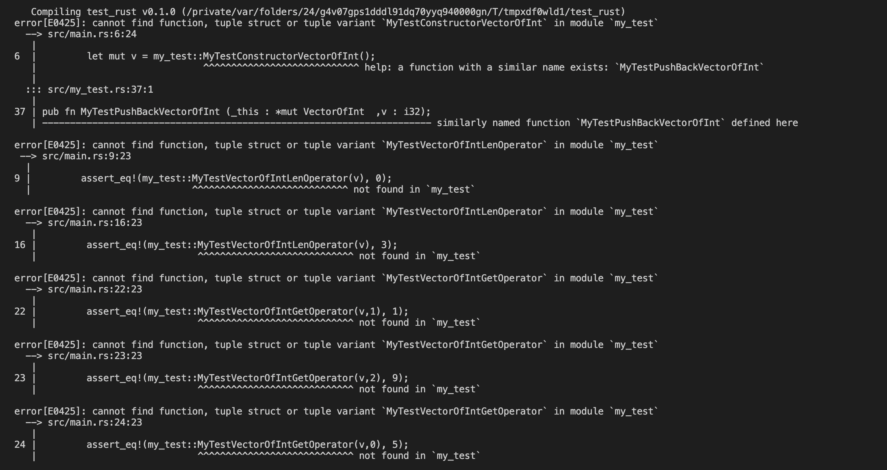|
| struct_bitfield_member_access.py     | [OK]     | [OK]     |         |
| struct_default_comparison.py         | [OK]     | [OK]     |         |
| struct_exchange.py                   | [OK]     | [OK]     |         |
| struct_inheritance.py                | [OK]     | [FAILED] | Duplicates in a few getters and setters cause an error in the compilation. In my_test.rs: 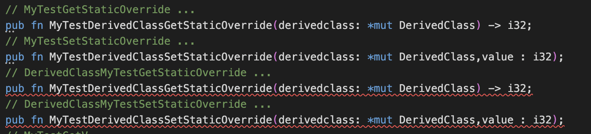 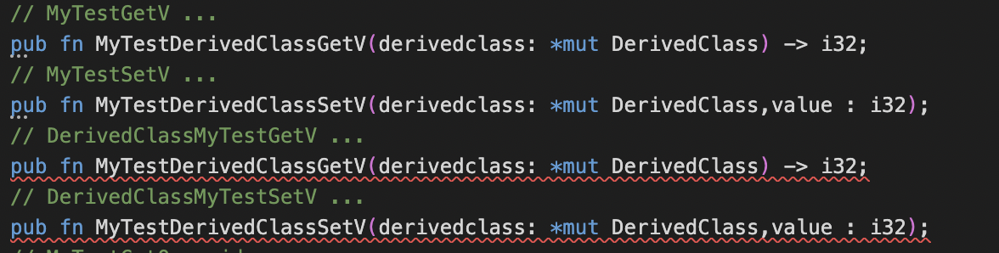 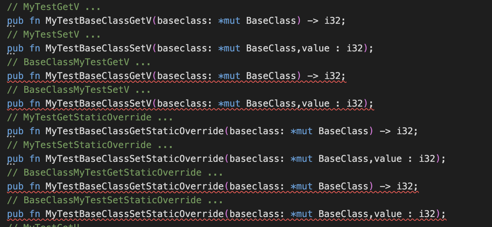|
| struct_inheritance_cast.py           | [OK]     | [OK]     |         |
| struct_instantiation.py              | [OK]     | [OK]     |         |
| struct_member_access.py              | [OK]     | [FAILED] | Error generated in the wrapper.cpp: The function MyTestSimpleStructGetTextField should return a `char*`but returns a `char`. 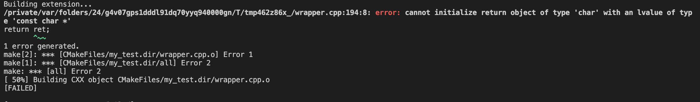|
| struct_method_call.py                | [OK]     | [FAILED] | Error in the creation of a function which causes a compilation error. 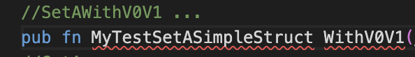|
| struct_nesting.py                    | [OK]     | [FAILED] | None returns are not implemented which causes an error in this test. 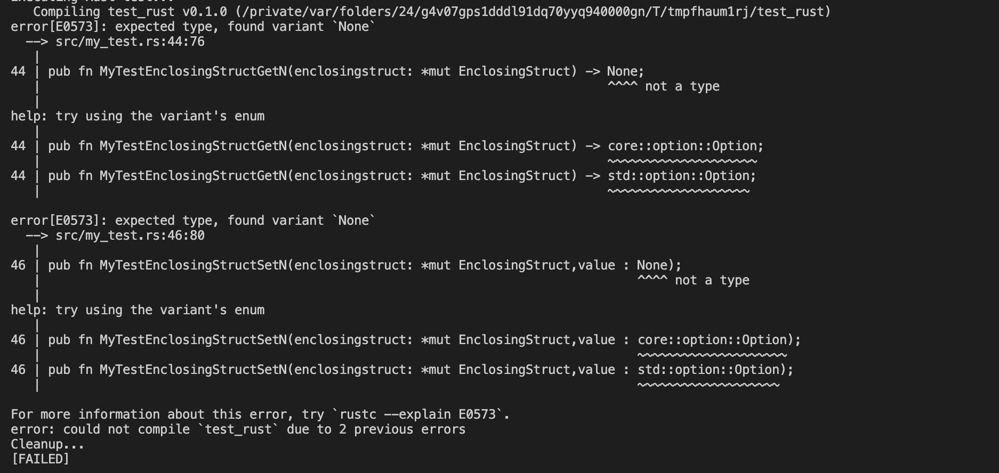|
| struct_operator_call.py              | [OK]     | [FAILED] | Error in the name generation of the function which writed a whitespace in the name creates a compilation error. 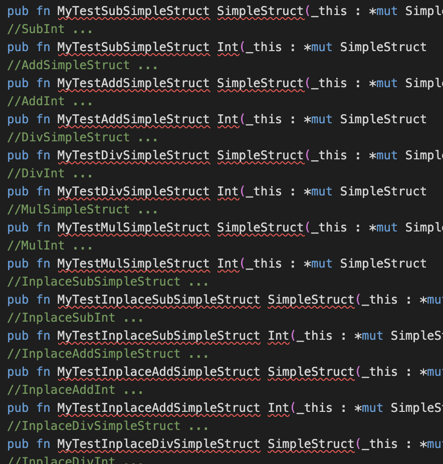|
| struct_static_const_member_access.py | [OK]     | [FAILED] | Error generated in the wrapper.cpp: The function MyTestSimpleStructGetTextField should return a `char*`but returns a `char`. |        |
| template_struct_nesting.py           | [OK]     | [FAILED] | None returns are not implemented which causes an error in this test. |
| transform_rval.py                    | [OK]     | [FAILED] | `string` return type is not recognized and generates a compilation error. 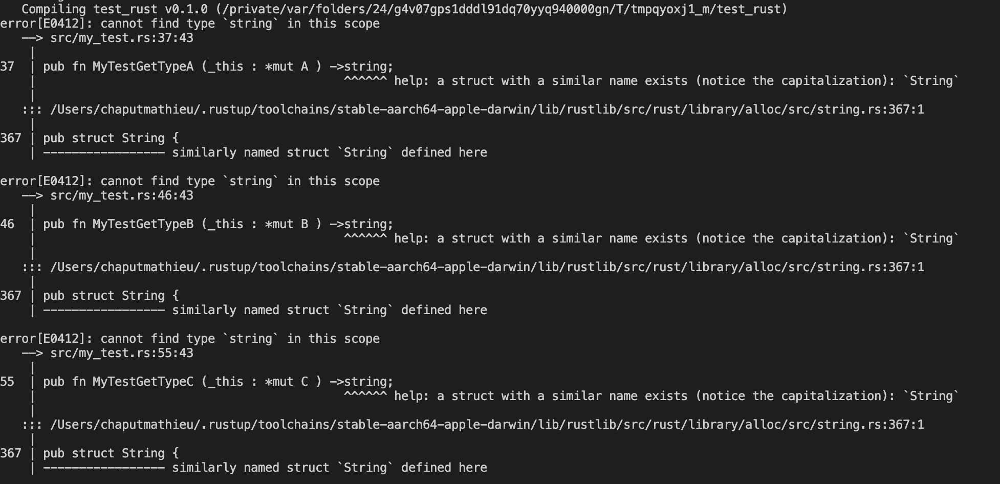|
| variable_access.py                   | [OK]     | [FAILED] | `None` returns, mutiple declaration of the same function and not named parameters generate a compilation error. 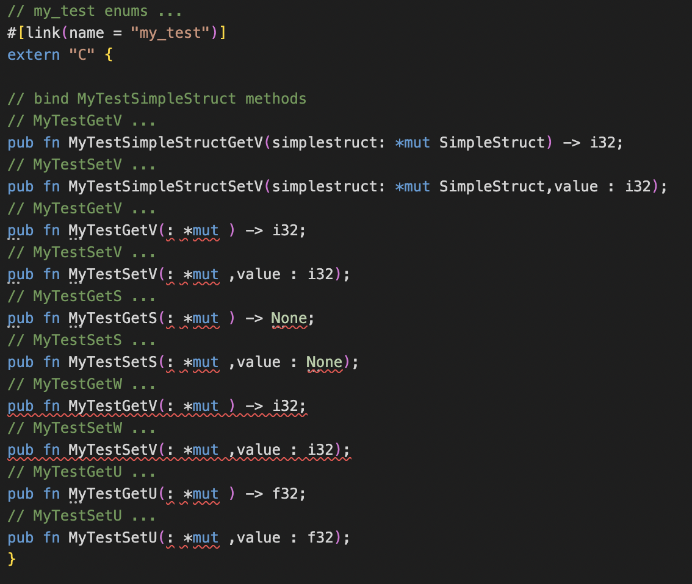 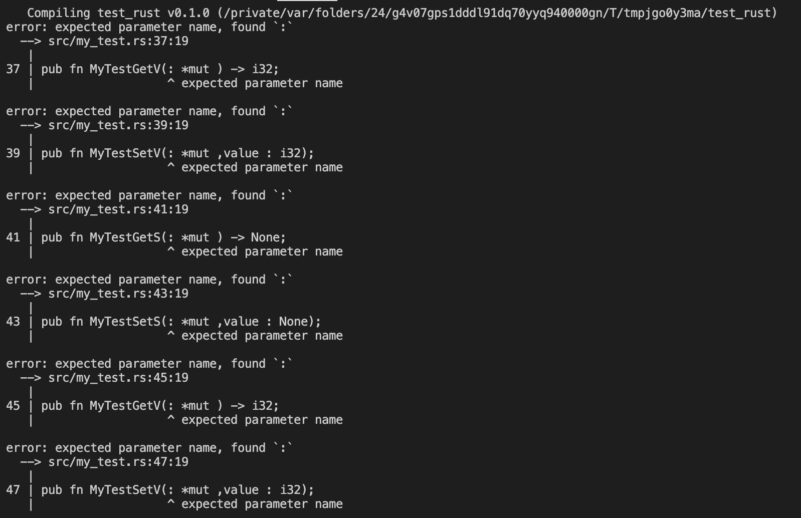|
